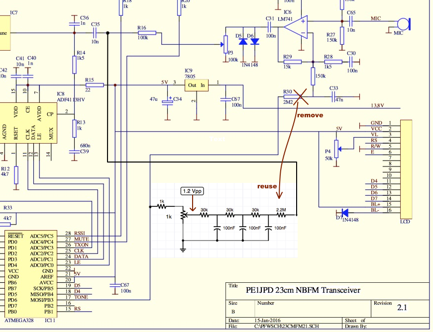
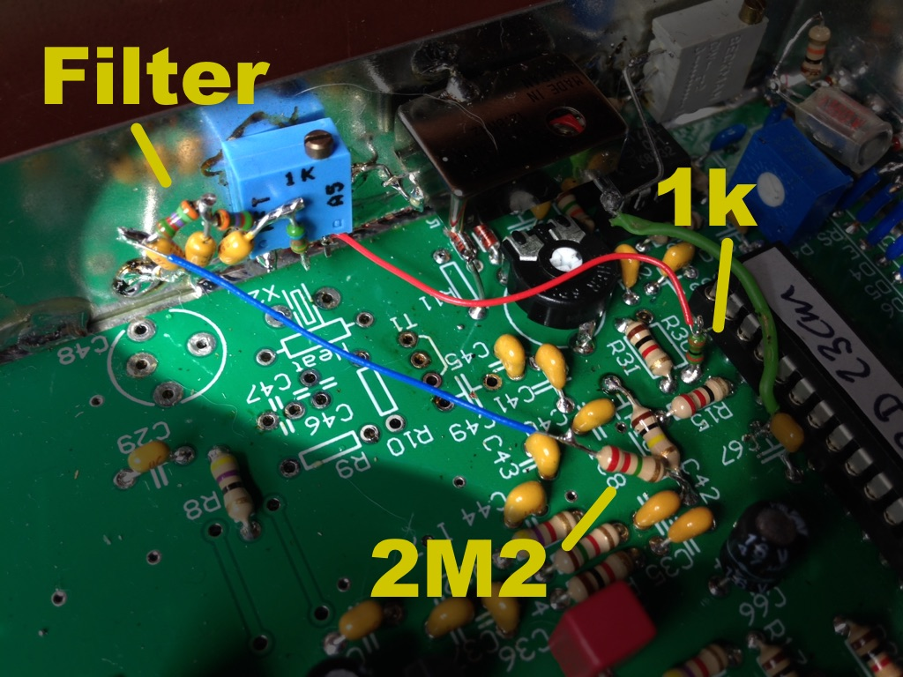

# Tips, Tricks and Hardware Modifications

Building the 23cm transceiver kit will get you a working transceiver, but you want
more of course. So here are my notes on modifications we've done on some of the
transceivers.

## Gotchas, problems and solutions

We had the following problems/defects when building the kit:
- The BF199 had a mirrored pinout. Some batches of BF199 transistors are incorrectly
  produced. If you insert these in the print it appears to be broken. (will be documented later)
- IC3, the 80MHz oscillator was defective
- Some kits have the Y17C VCO instead of the ALPS1679C. It is pin compatible, but the
  manufacturer has numbered its pins differently, so it is unclear how to mount this VCO.
  (will be documented later)
- Output signal was 2MHz wide. Monitoring the CP (Charge Pump) pin of the PLL, we noticed
  that the PLL was violently trying to keep the VCO on the Tx frequency, causing 400mV spikes
  on the Vtune pin of the Y17C VCO. We suspect a lower input impedance on the Y17C causes
  this. If you have this problem, a 100nF capacitor paralel to C36 will solve it. Please
  check your modulation after this modification.
- When transmitting, the voltage over D3, the 5v6 zener, drops to less than 4 Volts. R37
  heats up to the point it is too hot to touch. Output power seems to slowly drop when
  the resistor gets warmer.
- Heat, mainly from the CLY5 and R37 causes the 12MHz Chrystal (X2) to drift a bit. The 
  12MHz is multiplied over 100 times. This also increases this drift 100 times. For a 
  stable output frequency, a TCXO is strongly recommended. (will be documented later)
- A few of the through-hole capacitors turned out to have low resistance to ground. This
  might be caused by the heat needed to solder them to the casing. These almost-shorts
  caused strange problems. At first it seemed that the rotary encoder was broken, but it
  turned out to be a through-hole capacitor. Later the LCD panel started showing incorrect
  characters. This also was caused by one of the through-hole capacitors.
- The 88.5 sub-audio is a rather loud 88.1Hz square wave, making it not so "sub" ;-).
  It is generated by the Atmega328, which is running on its internal oscillator. This
  makes the frequency inaccurate, and some repeaters will have trouble detecting your
  sub-audio tone. [See below for a fix](#improve-subaudio-greatly).

## Modifications and improvements.

### Remove receiver audio rumbling

Even with a strong FM signal you'll notive a low rumble in the audio. This is the MC3362
detecting all audio frequencies. To stop the lower frequencies from reaching the speaker,
replace C24 with a 1nF capacitor.

### Improve Subaudio (greatly)

When using sub-audio to active a repeater, people will notice a ver noticeable hum on 
your audio. We noticed that this hum is caused by a combination of factors:

1. The subaudio is generated as a square wave by the Atmega328 processor, slightly
   filtered, and added to the microphone signal before the microphone pre-amp. At this
   point, it contains quite a few harmonics.
2. The Atmega328 is running on its internal oscillator. This is not exact, and in our case
   we noticed it to be lower than it should be. This causes the 88.5 sub-audio menu setting
   to generate a 88.1 sub-audio tone.
3. Turning up your mic gain also turns up the sub-audio with it.

This can be fixed with a simple 3rd order low-pass filter, and injecting the resulting
sub-audio tone after the microphone amplifier, like so:

Remove R30 (2M2) and save it. Connect a 1k resistor to pin 17 of the Atmega using
one of the pads where R30 was sitting. Build the rest of the low-pass filter as in the
schematic above, and re-use the 2M2 resistor to connect the output to R16 at the side of C35.

In my transceiver, it looks like this:

Power on the transceiver, select a sub-audio tone and connect an oscilloscope to the runner
of the potentiometer. When transmitting, adjust the output at the runner to 1.2 Vpp. It
should look like a square wave on your screen at that point.

When done correctly, this level should be enough to open any sub-audio repeater, but the
filtered tone will not be heard by the receiving party.
